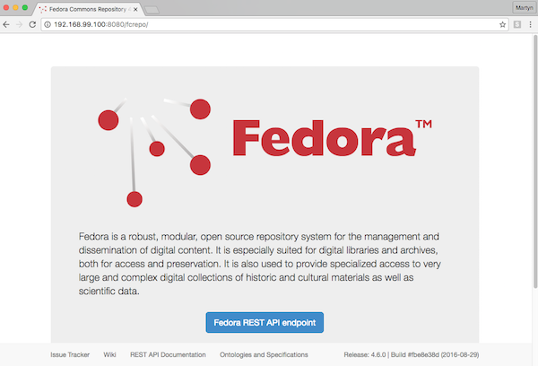

# Willow


## Introduction

[willow](https://github.com/CottageLabs/willow) is an implementation of the Fedora/Hydra stack by [Cottage Labs](http://cottagelabs.com/). It is built with Docker containers, which simplify development and deployment onto live services.


## Getting Started

  1. Install Docker [by following step 1 of the Docker Compose installation tutorial](https://docs.docker.com/compose/install/) on your machine.
  
  2. Make sure you don't need to `sudo` to run docker. [Instructions on set-up and how to test that it works.](https://docs.docker.com/engine/installation/linux/ubuntulinux/#/manage-docker-as-a-non-root-user)
  
  3. Install [Docker Compose by following steps 2 and onwards from the Docker Compose installation Tutorial](https://docs.docker.com/compose/install/).
  
    Ubuntu Linux users, the command that Docker-Compose provides you with will not work since /usr/local/bin is not writeable by anybody but root in default Ubuntu setups. Use `sudo tee` instead, e.g.:
    
    ```
    curl -L https://github.com/docker/compose/releases/download/[INSERT_DESIRED_DOCKER_COMPOSE_VERSION_HERE]/docker-compose-`uname -s`-`uname -m` | sudo tee /usr/local/bin/docker-compose > /dev/null && sudo chmod a+x /usr/local/bin/docker-compose
    ```
  
  4. Open a console and try running `docker -h` and `docker-compose -h` to verify they are both accessible.
  
  5. Clone this repository to a suitable place:
    ```bash
    $ cd /some/working/directory
    $ git clone https://github.com/CottageLabs/willow.git
    $ cd willow
    ```

  6. Create a `.env` file to set the postgres database username and password, and also the Rails session keys; you can use the `example.env` file as a template:
  
    ```
    POSTGRES_USER=postgres
    POSTGRES_PASSWORD=password
    SECRET_KEY_BASE_DEVELOPMENT=<a very long random hexadecimal number, e.g. 1234567890abcdef1234567890abcdef1234567890abcdef1234567890abcdef1234567890abcdef1234567890abcdef1234567890abcdef1234567890abcdef>
    SECRET_KEY_BASE_TEST=<a very long random hexadecimal number, e.g. 1234567890abcdef1234567890abcdef1234567890abcdef1234567890abcdef1234567890abcdef1234567890abcdef1234567890abcdef1234567890abcdef>
    SECRET_KEY_BASE_PRODUCTION=<a very long random hexadecimal number, e.g. 1234567890abcdef1234567890abcdef1234567890abcdef1234567890abcdef1234567890abcdef1234567890abcdef1234567890abcdef1234567890abcdef>
    ```

  7. Run docker-compose to build, and download and initialise the infrastructure
    ```bash
    $ docker-compose build
    $ docker-compose up
    ```
    
  8. If everything is successful, after a few minutes you should be able to see Fedora Commons running.
   
    Mac: `http://<docker_machine_ip>:8080/fcrepo/` (e.g. http://192.168.99.100:8080/fcrepo/)
    Linux: http://localhost:8080/fcrepo/
    
    
    
  9. You should also be able to see the Willow installation:
  
    Mac: http://192.168.99.100:3000
    Linux: http://localhost:3000

    